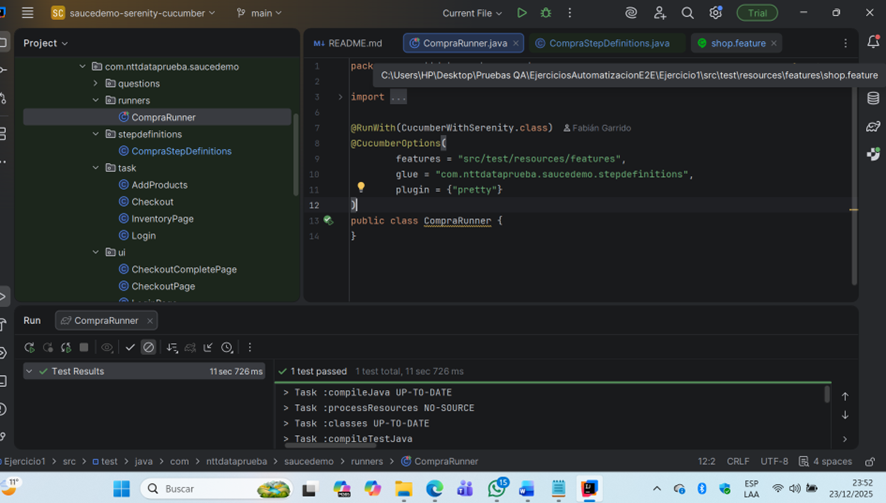

# Screenplay Pattern with Serenity BDD

This project is a practical demonstration of automated UI testing using the [Screenplay pattern](https://dzone.com/articles/page-objects-refactored-solid-steps-to-the-screenp), implemented with the [Serenity BDD](http://serenity-bdd.info/#/) library, [Cucumber](https://cucumber.io/) and JUnit 4.  
The tests automate the purchase flow on the [SauceDemo](https://www.saucedemo.com/) web application.

By default the tests run on Chrome, so make sure you have the latest chromedriver instance on your system path.

---

##Prer equisites

- Windows 10 / 11
- IntelliJ IDEA 2025.3.1 or higher
- Gradle 8.14
- JDK 11
- Google Chrome updated
- Git installed
- GitHub Desktop (optional)

---

## 📦 Dependencies

- net.serenity-bdd:serenity-core:3.9.8
- net.serenity-bdd:serenity-junit:3.9.8
- net.serenity-bdd:serenity-screenplay:3.9.8
- net.serenity-bdd:serenity-screenplay-webdriver:3.9.8
- net.serenity-bdd:serenity-cucumber:3.9.8
- io.cucumber:cucumber-java:7.14.0
- io.cucumber:cucumber-junit:7.14.0
- org.seleniumhq.selenium:selenium-java:4.21.0
- junit:junit:4.13.2
- org.slf4j:slf4j-simple:2.0.9

---

## 🔧 Para abrir el proyecto solo debes hacer lo siguiente:

1. **Cargar el proyecto** con *IntelliJ IDEA 2025.3.1*  
2. **Ejecutar** ▶️ en *IntelliJ IDEA 2025.3.1* la clase:  

\Ejercicio1\src\test\java\com\nttdataprueba\saucedemo\stepdefinitions\CompraStepDefinitions.java

Al hacerlo, se ejecutará el **RPA con Selenium** y se abrirá **Google Chrome**, como se muestra en este video:  
[Ver demostración en YouTube](https://youtu.be/QqNfAlVgDj8)

3. **Resultado final:**  

